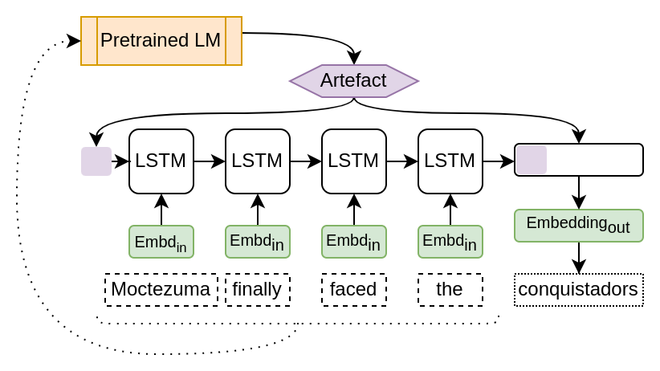
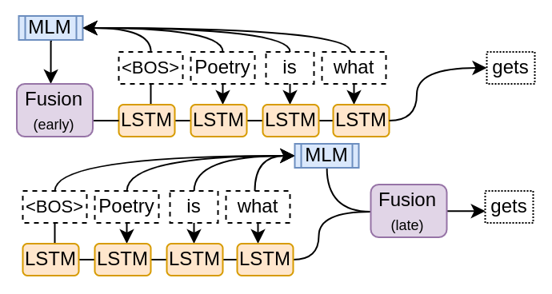

# Sentence Embedding Fusion

[](https://arxiv.org/abs/2208.02402)
&nbsp;
[](https://youtu.be/U8-h7pZFHc0)

Pretrained LM sentence embeddings as artefacts fused to language models.






# Paper

|||
|-|-|
|Title|Fusing Sentence Embeddings Into LSTM-based Autoregressive Language Models|
|Authors|Vilém Zouhar, Marius Mosbach, Dietrich Klakow|
|Abstract|Although masked language models are highly performant and widely adopted by NLP practitioners, they can not be easily used for autoregressive language modelling (next word prediction and sequence probability estimation). We present an LSTM-based autoregressive language model which uses prefix embeddings (from a pretrained masked language model) via fusion (e.g. concatenation) to obtain a richer context representation for language modelling. We find that fusion helps reliably in lowering the perplexity (16.74 → 15.80), which is even preserved after a transfer to a dataset from a different domain than the training data. We also evaluate the best-performing fusion model by correlating its next word surprisal estimates with human reading times. Contradicting our expectation, and despite the improvement in perplexity overall, the correlation remains the same as for the baseline model. Lastly, while we focus on language models pre-trained on text as the sources for the fusion, our approach can be possibly extended to fuse any information represented as a fixed-size vector into an auto-regressive language model. These include e.g. sentence external information retrieved for a knowledge base or representations of multi-modal encoders.|

```
@article{zouhar2022sentence,
  author = {Zouhar, Vilém and Mosbach, Marius and Klakow, Dietrich},
  title = {Fusing Sentence Embeddings Into LSTM-based Autoregressive Language Models},
  journal = {arXiv e-prints},
  keywords = {Computer Science - Computation and Language, Computer Science - Machine Learning},
  year = {2022},
  eid = {arXiv:2208.02402},
  eprint = {2208.02402},
  primaryClass = {cs.CL},
  url = {https://arxiv.org/abs/2208.02402},
}
```
